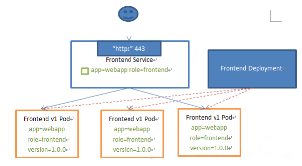
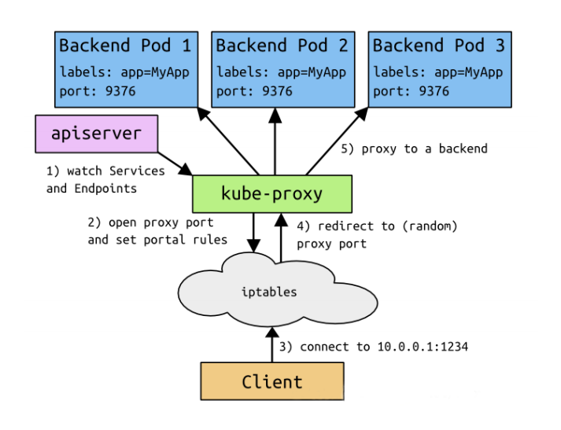
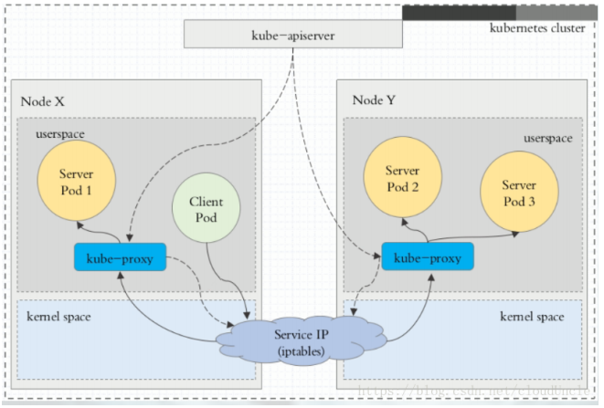
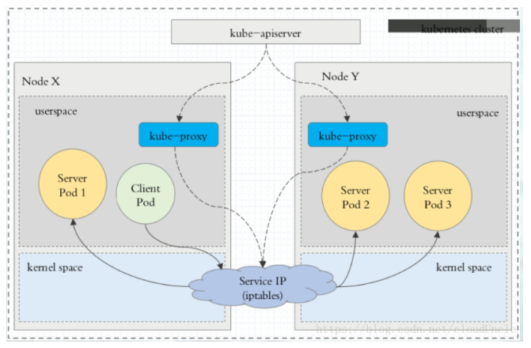
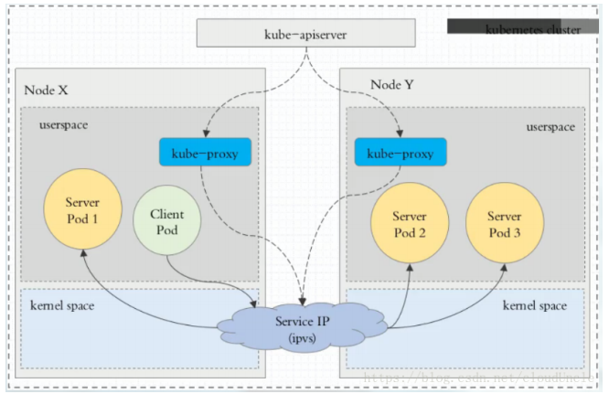
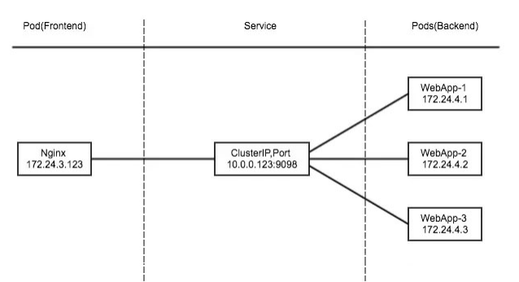
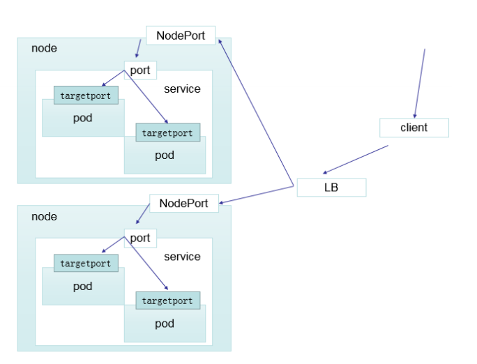

# Kubernetes Service

## 一、Service的概念

Kubernetes Service定义了这样一种抽象：一个Pod的逻辑分组，一种可以访问他们的策略——通常称之为微服务。这一组Pod能够被Service访问到，通常是通过Label Selector。



Service能够提供负载均衡的能力，但是在使用上有一下限制：

* 只提供了4层负载均衡能力，而没有7层功能，但有时我们可能需要更多的匹配规则来转发请求，这点上4层负载均衡时不支持的。

## 二、Service的类型

基础架构：



Service在K8S中有以下四种类型：

### 2.1 ClusterIP

* **默认类型，自动分配一个仅Cluster内部可以访问的虚拟IP**

### 2.2 NodePort

* **在ClusterIP基础上为Service在每条机器上绑定一个端口，这样就可以通过NodePort来访问该服务。**

### 2.3 LoadBalancer

* **在NodePort的基础上，借助云服务提供商，创建一个外部负载均衡器，并将请求转发到NodePort**

### 2.4 ExternalName

* **把集群外部的服务迎入到集群内不来，在集群中直接使用。**

## 三、VIP和Service代理

* 在Kubernetest集群中，每个Node运行一个`kube-proxy`进程，`Kube-proxy`负责为`Service`实现一种VIP（虚拟IP）的形式，而不是`ExternalName`的形式。

* 版本：

  * **v1.0：userspace代理模式**

    * 请求都要经过`kube-proxy`

    * 

  * **v1.1：iptables代理模式**

    * 请求不需要经过`kube-proxy`
    * 

  * **v1.8：ipvs代理模式**

    * 请求不需要经过`kube-proxy`

    * 与iptabls功能类似，性能更好，所有节点必须安装ipvs。

    * ```sh
      ipvsadm -Lm
      ```

    * 


## 四、功能演示

### 2.1 ClusterIP

* **ClusterIP主要是每个node节点使用iptables，将发送ClusterIP对应端口的数据，转发到kube-proxy中。然后kube-proxy自己内部实现有负载均衡的方法，可以查询到这个Service下对应pod的地址和端口，进而吧数据转发给对应的Pod的地址和端口。**

* 

* 为了实现图上的功能，主要需要以下几个组件的协同工作；

  * ApiServer 用户通过kubectl命令想ApiServer发送创建Service的命令，ApiServer接受到请求之后将数据存储到etcd中。
  * Kubernetes的每个节点中都有一个叫做kuber-proxy的进程，这个进程负责感知Service、Pod的变化，并将变化信息写u人本地iptables的规则中。
  * iptables使用NAT等技术将Virtual IP的流量转至endpoint。

* HeadlessService

  * 有时不需要或不想要负载均衡，以及单独的Service IP。这种情况下，可以指定ClusterIP(spec.clusterIP)的值为"None"来创建Headless Service。这类Service并不会分配ClusterIP，kube-proxy不会处理他们，而且平台也不会为它们进行负载均衡和路由

* Example：

  ```yaml
  # myapp-deploy.yaml
  apiVersion: apps/v1
  kind: Deployment
  metadata:
    name: myapp-deploy
    namespace: default
  spec:
    replicas: 3
    selector:
     matchLabels:
       app: myapp
       release: stabel
     template:
       metadata:
         labels:
           app: myapp
           release: stabel
           env: test
       spec：
         containers:
         - name: myapp
           image: nginx
           imagePullPolicy: IfNotOPresend
           port:
           - name：http
             containerPort: 80
             
  # app-service.yaml
  apiVersion: v1
  kind: Service
  metadata:
    name: myapp
    namespace: default
  spec:
    type: ClusterIP
    selector:
      app: myapp
      release: stabel
   ports:
   - name: http
     port: 80
     targetPort: 80
     
  # myapp-svc-headless.yaml
  apiVersion: v1
  kind: Service
  metadata:
    name: myapp-headless
    namespace: default
  spec:
    selector:
      app: myapp
    clusterIP: "None"
    ports:
    - port: 80
      targetPort: 80
      
  # kubectl get pod -n kube-system -o wide
  # 找到指定的coredns，获取其ip，并通过ip进行解析。
  # dig -t A myapp-headless.default.svc.cluster.local @ip
  ```

  

### 2.2 NodePort

- **NodePort的原理在于在node上开了一个端口，将向该端口的流量导入到kube-proxy，然后由kuber-proxy进一步到给对应的Pod**

- Example:

  ```yaml
  # app-service.yaml
  apiVersion: v1
  kind: Service
  metadata:
    name: myapp
    namespace: default
  spec:
    type: NodePort
    selector:
      app: myapp
      release: stabel
   ports:
   - name: http
     port: 80
     targetPort: 80
  ```

### 2.3 LoadBalancer

- **LoadBalancer和NodePort其实是同一种方式。区别在于LoadBalancer比NodePort多一步，就是借助云服务提供商，创建一个LoadBalancer来进行向节点导流**
- 

### 2.4 ExternalName

- **这种类型的Service通过返回CNAME和它的值，可以将服务映射到ExternaleName字段的内容（例如：www.baidu.com）。ExternalName Service是Service的特例，它没有selector，也米有定义任何端口和Endpoint。相反的，对于运行在集群外部的服务，它通过返回该外部服务的别名这种方式来提供服务。**

- Example：

  ```yaml
  apiVersion: v1
  kind: Service
  metadata:
    name: my-service-1
    namespace: default
  spec:
    type: ExternalName
    externalName: www.baidu.com
  ```

- 当查询主机 my-service-1.default.svc.cluster.local(SVC_NAME.NAMESPACE.svc.cluster.local)时，集群的DNS会返回一个值www.baidu.com 的CNAME记录。访问这个服务的工作方式和其他的相同，唯一不同的是重定向发生在DNS层，而且不会进行代理或者转发。