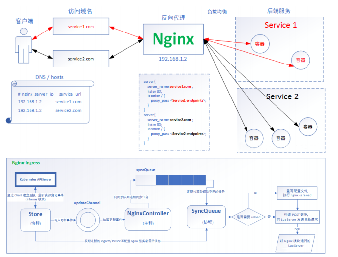

# Kubernetes Nginx-Ingress

## 一、功能介绍

* 前面我们已经学习过NodePort，可以通过NodePort的方式把服务对外暴露，但是使用NodePort面临着许多问题：**NodePort端口一旦增加，维护复杂。**在非容器化的服务中，我们可以使用Nginx作为反向代理和负载均衡转发请求到对应的服务上去。那么K8S有没有类似的功能呢?
* 答案就是Nginx-Ingress：



## 二、K8S安装

* 官网：https://kubernetes.github.io/ingress-nginx/
* 基本安装方法，可参考官网，这里使用的是Helm安装。

### 2.1 安装Helm

```sh
# 下载适合的版本
# https://github.com/helm/helm/releases
cp helm /usr/local/bin
chmod a+x /user/local/bin
helm version
```

### 2.2 下载Nginx-Ingress

* 官网步骤：

  ```sh
  helm repo add ingress-nginx https://kubernetes.github.io/ingress-nginx
  helm install my-release ingress-nginx/ingress-nginx
  ```

* 下载会比较慢，这时候，我们使用阿里云的镜像地址。但是需要注意下，阿里云的版本跟Github比较，会落后几个版本，我安装的时候阿里云的镜像版本为0.25.0，而Github版本为0.30.0

  ```
  helm repo add apphub-incubator https://apphub.aliyuncs.com/incubator/
  helm install my-release apphub-incubator/nginx-ingress
  ```

### 2.3 开始安装

* 实际安装中，会有点问题。提示异常，这里我们进行稍微改动以下。

* 拉取Chart

  ```sh
  helm pull apphub-incubator/nginx-ingress
  ```

* 配置Nginx-Ingress

  ```sh
  # vim values.yaml
  # 使用主机网络， 改为 true
  hostNetwork: false
  # 切换为NodePort， 改为 NodePort
  type: LoadBalancer
  # rbac是权限相关
  rbac：
  # false 改为 true
    create: false
  ```

* Deployment中apiVersion不匹配

  ```
  Error: unable to build kubernetes objects from release manifest: unable to recognize "": no matches for kind "Deployment" in version "extensions/v1beta1"
  ```

  * 这里我们需要批量修改 nginx-ingress deployment 文件的 apiVersion。

  * ```sh
    grep -irl "extensions/v1beta1" nginx-ingress | grep deploy | xargs sed -i 's#extensions/v1beta1#apps/v1#g'
    ```

    * grep -irl "extensions/v1beta1" nginx-ingress
      - grep查找文件，
      - -i， 忽略字符大小写的差别。
      - -r，文件夹递归
      - -l，列出文件内容符合指定的样式的文件名称
    * grep deploy
      - 搜索包含deploy的yaml文件名称
    * xargs sed -i 's#extensions/v1beta1#apps/v1#g'
      - 多文件替换

* Deployment缺失selector

  ```
  Error: unable to build kubernetes objects from release manifest: error validating "": error validating data: ValidationError(Deployment.spec): missing required field "selector" in io.k8s.api.apps.v1.DeploymentSpec
  ```

  * 在 deployment 文件添加 selector

  * ```
      selector:
        matchLabels:
          app: {{ template "nginx-ingress.name" . }}
    ```

  * ```sh
    vi nginx-ingress/templates/controller-deployment.yaml
    ```

  * 

  * ```sh
    vi nginx-ingress/templates/default-backend-deployment.yaml
    ```

  * 

* ```sh
  # 在执行
  helm install
  ```

### 2.4 Nginx-Ingress组成

```
kubectl get pods
```


- 由于我们创建的时候，没有指定命名空间，所以相关pod就在default空间了。

由上图可知，nginx-ingress 包括 2 个组件：

1）nginx-ingress-controller：nginx-ingress 控制器，负责 nginx-ingress pod 的生命周期管理。nginx-ingress pod 本质就是 nginx。用来处理请求路由等功能。这也是为什么称 nginx-ingress pod 是集群流量入口的缘故。

2）nginx-ingress-default-backend：默认后端。如果你没有配置路由或路由配错了，将会由此 pod 判断，一般会显示 404 给你。

### 2.5 测试

```
kubectl get svc
```


端口是随机分配的，ingress已经搭建成功，直接访问宿主机的18006端口即可访问，现在提示404。除了宿主机，所有的集群节点，18006，都可以访问通。

## 三、实例测试

### 3.1 Ingress HTTP代理访问

* Deployment、Service略

* ingress.yaml

  ```yaml
  apiVersion: extensions/v1beta1
  kind: Ingress
  metadata:
    name: nginx-test
  spec:
    rules:
     - host: www.example.com
       http:
         paths:
         - path: /
           backend:
             # 匹配到nginx-svc的Service的80端口
             serviceName: nginx-svc
             sevicePort: 80
  ```

### 3.2 Ingress HTTPS代理访问

* 创建密钥

  ```
  openssl req -x509 -nodes -days 365 -newkey rsa:2048 -keyout tls.key -out tls.crt -subj "/CN=nginxsvc/)=nginxsvc"
  ```

* 保存到K8S密钥

  ```
  kuberctl create secret tls tls-secret --key tls.key --cert tls.crt
  ```

* Ingress.yaml

  ```yaml
  apiVersion: extensions/v1beta1
  kind: Ingress
  metadata:
    name: nginx-test
  spec:
    tls:
      - hosts:
        - www.example.com
        secretName: tls-secret
    rules:
     - host: www.example.com
       http:
         paths:
         - path: /
           backend:
             # 匹配到nginx-svc的Service的80端口
             serviceName: nginx-svc
             sevicePort: 80
  ```

### 3.3 Nginx进行basic-auth

* 创建用户名密码

  ```
  yum inistall httpd
  htpasswd -c auth user1
  ```

* 创建K8S Secret 存储密码

  ```
  kubectl -n <namespace> create secret generic basic-auth --from-file=auth
  ```


* 创建Ingress
  ```yaml
  apiVersion: extensions/v1beta1
  kind: Ingress
  metadata:
    name: ingress-with-auth
    annotations:
      nginx.ingress.kubernetes.io/auth-type: basic
      nginx.ingress.kubernetes.io/auth-secret: basic-auth
      nginx.ingress.kubernetes.io/auth-realm: "Authentication Required - user1"
  spec:
    rules:
      - host: www.example.com
        http:
          paths:
            - path: /
              backend:
                serviceName: nginx-svc
                servicePort: 80
  ```

* 验证

  ```
  ➜  curl -I http://www.example.com/targets
  HTTP/1.1 401 Unauthorized
  
  ➜ curl -I -XGET http://www.example.com/targets -u "user1:bar"
  HTTP/1.1 200 OK
  ```

### 3.4 请求重写

| Name                                           | Description                                                  | Values |
| :--------------------------------------------- | :----------------------------------------------------------- | :----- |
| nginx.ingress.kubernetes.io/rewrite-target     | 重定向目标URI                                                | string |
| nginx.ingress.kubernetes.io/ssl-redirect       | 指定位置部分是否仅可访问SSL（当Ingress包含证书时默认为True） | bool   |
| nginx.ingress.kubernetes.io/force-ssl-redirect | 即使Ingress未启动TLS，也强制重定向到HTTPS                    | bool   |
| nginx.ingress.kubernetes.io/app-root           | 定义Controller必须重定向的应用程序根，如果它在'/'上下文中    | string |
| nginx.ingress.kubernetes.io/use-regex          | 指定Ingress上定义的路径是否使用正则表达式                    | bool   |

* ```yaml
  apiVersion: networking.k8s.io/v1beta1
  kind: Ingress
  metadata:
    annotations:
      nginx.ingress.kubernetes.io/rewrite-target: http://foo.bar.com/
    name: rewrite
    namespace: default
  spec:
    rules:
    - host: rewrite.bar.com
      http:
        paths:
        - backend:
            serviceName: http-svc
            servicePort: 80
  ```

  